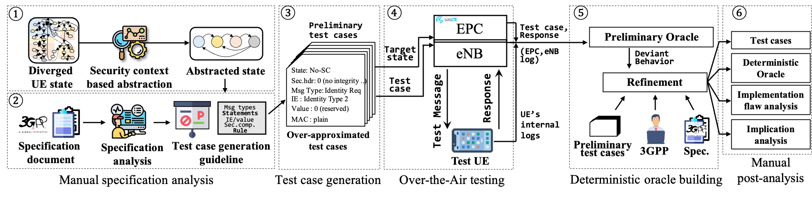
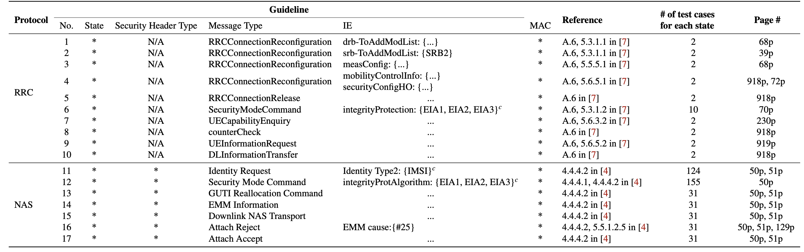
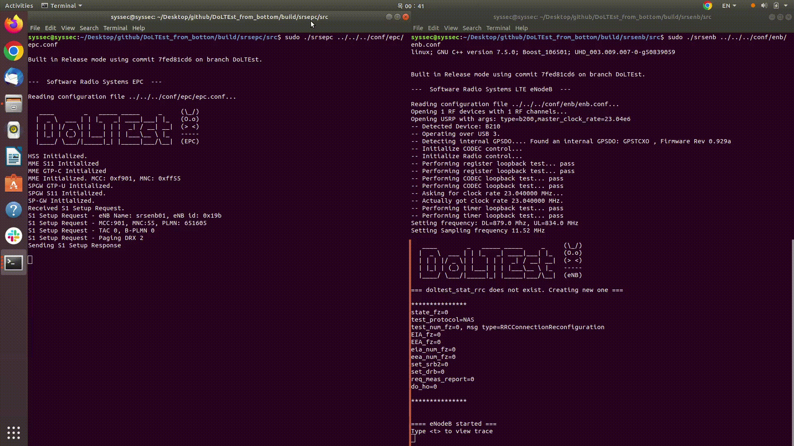

Description
========
DoLTEst is a negative testing framework to uncover the non-standard-compliant behaviors in LTE implementations of end-user devices.
Despite numerous implementation vulnerabilities reported, a lack of negative testing in specification still leaves other implementation vulnerabilities unchecked.
It is an abbreviation for "Downlink LTE Test" or "(Let's) Do LTE Test" 😉. 

## What is DoLTEst for?
An implementation flaw in LTE control plane protocols at end-user devices directly leads to severe security threats. In order to uncover these flaws, conducting negative testing is a promising approach, whose test case only contains invalid or prohibited messages. Despite its importance, the cellular standard mostly focuses on positive test cases, producing many implementation vulnerabilities unchecked, as evidenced by many existing vulnerabilities.

To fill this gap, we present DoLTEst, a negative testing framework, which can comprehensively test an end-user device. Enumerable test cases with a deterministic oracle produced from detailed specification analysis make it suitable to be used as a standard to find implementation vulnerabilities. We uncovered 26 implementation flaws from 43 devices from 5 different baseband manufacturers by using DoLTEst, demonstrating its effectiveness.

|  | 
|:--:| 
| *Overview of DoLTEst. This repository mainly covers ➃, and the rests are DESIGN part* |
 
Also, the test cases covered in DoLTEst are shown below. 

 
|  | 
|:--:| 
| *Guidelines and the corresponding number of test cases. Note that if the guideline involves two IEs (i.e., handover procedure by using RRCConnectionReconfiguration), DoLTEst adds both IEs in generating test cases. We omitted non-trivial IE values for brevity. The * represents the wildcard explained in §5.2.2. We used RRC specification version 15.10.0 [[7](https://www.etsi.org/deliver/etsi_ts/136300_136399/136331/15.10.00_60/ts_136331v151000p.pdf)], and NAS specification version 16.5.1 [[4](https://www.etsi.org/deliver/etsi_ts/124300_124399/124301/16.05.01_60/ts_124301v160501p.pdf)].* |


Please refer to [our
paper](https://www.usenix.org/system/files/sec22summer_park-cheoljun.pdf) for more details. 


DoLTEst Manual
========

DoLTEst is implemented on top of the [srsLTE](https://github.com/srsran/srsRAN).
So it requires the same setup as when establishing your own LTE network using srsENB, srsEPC, and a COTS UE.
Please refer to the [SRS team's docs](https://docs.srsran.com/en/latest/app_notes/source/cots_ue/source/index.html?highlight=sim#hardware-required) for the set-up details. 

**Prerequisite**
 - Software-Defined Radio (SDR). We used USRP B210.
 - Ubuntu PC (we used 18.04) that can execute the srsLTE. 
 - Programmable SIM card (and smart card reader). We used [sysmoISIM](http://shop.sysmocom.de/products/sysmoISIM-SJA2). 
 - Test UE
 - Faraday cage (recommended)
 
**About using a Faraday cage**
 >We recommend you to use a Faraday cage. Otherwise, nearby UEs may attempt to connect. This can cause DoS in normal UEs, even though DoLTEst does not send a test message to an unknown UE. Also, operating an LTE signal on licensed frequencies might be illegal in your country (Each country has unique regulations regarding the wireless transmission of signals, and these regulations are drafted, implemented, and modified by each country's government, not by an international organization).
 
***Dependencies***
```
sudo apt-get install build-essential cmake libfftw3-dev libmbedtls-dev libboost-program-options-dev libconfig++-dev libsctp-dev
```

**Building**
```
git clone https://github.com/SysSec-KAIST/DoLTEst.git
cd DoLTEst
mkdir build && cd build
cmake ..
make -j4
```

**Executing**
```
(Terminal 1)
cd ($DoLTEst)/build/srsepc/src
sudo ./srsepc ../../../conf/epc/epc.conf
```
```
(Terminal 2)
cd ($DoLTEst)/build/srsenb/src
sudo ./srsenb ../../../conf/enb/enb.conf
```

When the test UE connects to srseNB, DoLTEst starts: it moves the testing UE's state to the target state, and sends the test message, in the following order: 1. ```(No-SC state, NAS testing)``` -> 2. ```(No-SC state, RRC testing)``` -> 3. ```(N-SC state, NAS testing)``` -> ...

You can see the testing progress on the terminal. 

To finish the test, press ```ctrl + c``` to stop the srsEPC and srseNB. After then, please check the **enb.pcap** to analyze the result. 
The intermediate test progress files, **doltest_stat_nas** and **doltest_stat_rrc** under ($DoLTEst)/conf/ are updated after sending each test message. 

# Tips
- If UE does not try to re-attach for a long time, toggle airplane mode. 
- When stopping the test, we recommend to stop ```srsEPC``` -> turn on ```airplane mode``` on ```UE``` -> stop ```srseNB```. To start again, start ```srsEPC``` -> start ```srseNB``` -> turn off ```airplane mode``` on UE
- If you are using the Faraday cage, you need to operate another srseNB to test two IEs related to measurement and handover. You need to put the other eNB's EARFCN and PCI value on the following function, and recompile. 
```
($DoLTEst)/srsenb/src/stack/rrc/rrc.cc
1) Change target measurement frequency in function doltest_rrc_conn_recfg. Search for '//[DoLTEst] Change this EARFCN'
2) Change target cell pci in function doltest_rrc_conn_recfg. Search for '// [DoLTEst] Change this PCI' 
```
- Options: Two modes at srsEPC, 
  - ```--reset-ctxt-mode```: Network will send Attach Reject with cause _illegal UE_ to delete UE's previous security context (default: false) 
  - ```--long-test-mode```: DoLTEst will test every identity type values (default: false). 

# Finding bugs
- For each test message, UE sending a corresponding response message is a bug, except for the below cases. 
- UE sending a reject or an error message (```Security Mode Failure```, ```EMM Status```, ```RRC ConnectionReestablishmentRequest```) is not a bug. 
- UE sending ```RRC ConnectionReconfigurationComplete``` message for the test message ```RRC ConnectionReconfiguration``` with ```measConfig``` at state ```No-SC``` and ```N-SC``` is standard-compliant behavior. However, sending ```MeasurementReport``` is a bug. 
- When testing RRC message, UE responding to ```UE CapabilityEnquiry```, ```DLInformationTransfer```, or accepting ```RRC Connection Release``` at state ```No-SC``` and ```N-SC``` is not a bug. 
- When testing NAS message, UE sending Identity Response with its IMSI at state ```No-SC``` is not a bug. 

If you need any help for verifing the UE's behavior, please contact fermioncj@kaist.ac.kr. 
Also, we wonder if DoLTEst helped you to find a vulnerability. Please let us know!

# Credits
We sincerely appreciate the [SRS team](https://www.srs.io) for making their great software available :)

# BibTex
Please refer to [our
paper](https://www.usenix.org/system/files/sec22summer_park-cheoljun.pdf) for more details. 

```bibtex
@inproceedings{park:doltest,
  title = {{DoLTEst: In-depth Downlink Negative Testing Framework for LTE Devices}},
  author = {Park, CheolJun and Bae, Sangwook and Oh, BeomSeok and Lee, Jiho and Lee, Eunkyu and Yun, Insu and Kim, Yongdae},
  booktitle = {31th USENIX Security Symposium (USENIX Security 22)},
  year = {2022}
}
```
